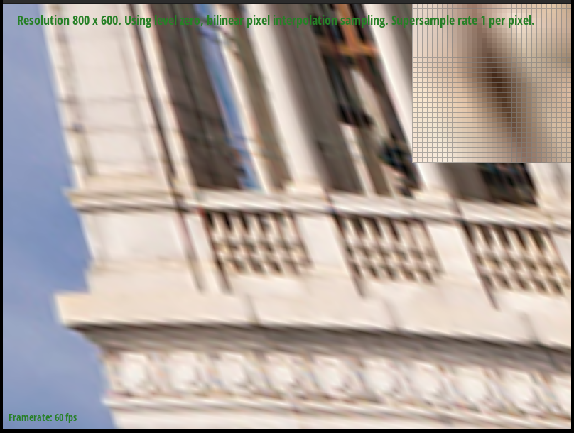

# Project 1: Rasterizer

## Task 1: Drawing Single-Color Triangles

To rasterize a triangle, my naive algorithm goes through the following process:

 - First, calculate the area of the triangle, using the formula $$A = \frac{1}{2}(x_0y_1 + x_1y_2 + x_2y_0 - x_1y_0 - x_2y_1 - x_0y_2)$$. If the area is positive, the winding order of the points must be clockwise; if the area is negative, the winding order of the points must be counterclockwise.
 - If the winding order is counterclockwise, swap points 1 and 2 to make the winding order clockwise.
 - Calculate the bounding box of the 3 points
 - Loop through all the points in the bounding box, in row-major order (same order as the `sample_buffer` matrix)
    - for each point, perform the 3 line tests. If all 3 tests pass, fill the corresponding pixel in `sample_buffer`.

The line tests implement the "left-top" rule for deciding points on the edges of the triangle. This algorithm only considers points in the bounding box of the triangle, so it should perform no worse than any other algorithm that checks each sample in the bounding box of the triangle.

As expected, this algorithm tends to create jaggies. In Example 2 below, there is also the illusion of "disconnected" points as only a few samples fall inside the triangle.

Example 1                           |  Example 2
:----------------------------------:|:--------------------------------------:
  |  

After implementing the naive algorithm, I then implemented an optimized version: 
 - Calculate area, swap points, and calculate the bounding box (just like the naive algorithm)
 - Loop through all the y values in the bounding box
    - For each y value, calculate the x-intercepts of the 3 lines through that horizontal line. Use line tests to determine which side of the x-intercept is inside the triangle.
    - Take the intersection of the 3 lines segments to determine then endpoints of the horizontal line segment inside the triangle.
    - Use `std::fill_n` to fill the corresponding samples inside the line segment with `color`.

This optimized version tends to have between 2.5x and 8x faster frame times than the naive algorithm. Here's a handy-dandy chart of a few tests I ran:

The raw timing data can be found [here](timing_data.tsv).

## Task 2: Antialiasing by Supersampling

Supersampling is a useful antialiazing technique because it is effective at reducing "jaggies", and closely approximates what a high-fidelity version of the image would look like if mapped onto the limited number of pixels. Compared to other antialiasing techniques, supersampling is conceptually simple, and also avoids "background leak". With some alternate antialiasing techniques (for example, one that blurs the edges of the triangle before drawing), the background pixels get mixed with the triangles pixels, which may end up causing the background to "leak" into edges where two triangles meet.

Supersampling was used for drawing triangles by scaling the triangle up, taking a sample for each "scaled" pixel, then once all the triangles were drawn, averaging the scaled pixels to get the value of each "regular" pixel. 

To accommodate supersampling, several changes needed to be made to the rendering pipeline:

 - The `sample_buffer` needed to be resized to `(width * height * samples * samples)`, where `samples` is the integer square root of the sample rate. This new length was used when the buffer was initialized, but also whenever the dimensions were changed and whenever the buffer was cleared.
 - The `rasterize_point` method was changed to loop through all the samples corresponding to that pixel
 - The `rasterize_triangle` method needed to scale all the points up by `samples`, in order to correctly map onto the `sample_buffer`
 - The `resolve_to_framebuffer` method needed to average all the samples corresponding to each pixel, in order the get the true pixel color.

The resulting images are significantly nicer, particularly with high sample rates. Here is an example at 1, 4, 9, and 16 samples:

:----------------------------------:|:--------------------------------------:
  |  
  |  

I also implemented jittered supersampling, which takes samples from a random point within each subpixel, rather than the middle of each subpixel. The effect of this is particularly noticeable on horizonal edges, where the average value of the pixels more accurately reflects how far down the edge is. Non-jittered supersampling with 4 samples can only fully color an edge, half color an edge, or not color an edge; this is doesn't accurately represent edges that, for example, cover 1/3rd of a row of pixels. The downside is that the jittered image appears less "smooth".

Normal                         |  Jittered
:----------------------------------:|:--------------------------------------:
  |  

## Task 3: Transforms

To implement transforms, I implemented the following matrices:

Translate                           |  Scale | Rotate
:----------------------------------:|:--------------------------------------:|:-----:
$$\begin{bmatrix}1 & 0 & d_x \\0 & 1 & d_y\\0 & 0 & 1 \end{bmatrix} $$   |  $$\begin{bmatrix}s_x & 0 & 0 \\0 & s_y & 0\\0 & 0 & 1 \end{bmatrix} $$ | $$\begin{bmatrix}\cos(\theta) & -\sin(\theta) & 0 \\ \sin(\theta) & \cos(\theta) & 0\\0 & 0 & 1 \end{bmatrix} $$

Here is cubeman pretending to be a cube:

SVG                         |  PNG Screenshot
:----------------------------------:|:--------------------------------------:
  |  

I also added two buttons (N and M) to rotate the viewport. To accomplish this, I added a function that multiplied the `svg_to_ndc` matrix by the following rotation matrix:

$$\begin{bmatrix} \cos(\theta) & -\sin(\theta) & (1 - \cos(\theta) + \sin(\theta)) \\ \sin(\theta) & \cos(\theta) & (1 - \sin(\theta) - \cos(\theta)) \\0 & 0 & 1 \end{bmatrix}$$

This is different from the other rotation matrix, because this one rotates around the center of the view (0.5, 0.5), rather than the origin. In order to make scaling and panning work correctly (since in the given implementation, it would always reset the view, clearing rotation), I changed the `move_view` function to set the `svg_to_ndc` matrix to the following:

$$\begin{bmatrix} m_{0,0} & m_{0,1} & (m_{0,2} + d_x) + 0.5 (z - 1) m_{2,2} \\m_{1,0} & m_{1,1} & (m_{1,2} + d_y) + 0.5 (z - 1) m_{2,2} \\m_{2,0} & m_{2,1} & z m_{2,2} \end{bmatrix}$$

Where $$(d_x, d_y)$$ is the amount of pan, $$z$$ is the zoom factor, and $$m$$ is the original `svg_to_ndc` matrix.

Here are some screenshots of cubeman rotated and zoomed in:

:----------------------------------:|:--------------------------------------:
  |  
  |  

## Task 4: Barycentric Coordinates

Barycentric coordinates are locations with respect to the corners of a triangle. For example, the  barycentric coordinates $$(0.1, 0.3, 0.6)$$ represent a point that is relatively far away from $$p_0$$, closer to $$p_1$$, and much closer to $$p_2$$. They can also be interpreted as "If I placed these weights at the corners of the triangle, this location would be the center of mass".

In the left example below, higher $$\alpha$$ values are blue, higher $$\beta$$ values are green, and higher $$\gamma$$ values are red. The resulting gradient shows how the barycentric coordinates are distributed within one triangle. On the right is the result of `test7.svg`. 

Single Triangle                         |  test7.svg
:----------------------------------:|:--------------------------------------:
 |  

## Task 5: Pixel Sampling for Texture Mapping

Pixel sampling is one technique for mapping a texture onto a given polygon (triangles, for this project). For every pixel in the triangle, it's location within the texture is calculated by using Barycentric coordinates to map from the original triangle to the texture triangle. Then, its color within the texture is calculated using a sampling technique:

 - In nearest pixel sampling, the color of the nearest pixel in the texture is used. For example, given location $$(6.32, 22.99)$$ in the texture, the color at $$(6, 22)$$ would be used (which has a location of $$(6.5, 22.5)$$.
 - In bilinear pixel sampling, the colors of the 4 nearest pixels are linearly interpolated. For example, given location $$(6.32, 22.99)$$ in the texture, the colors at $$(5, 22)$$, $$(6, 22)$$, $$(5, 23)$$, and $$(5, 23)$$ would be linearly interpolated based on the proportions 0.82 in the x-axis, and 0.49 in the y-axis.

Nearest pixel sampling is simpler, but bilinear sampling can be smoother when the texture is magnified. For example, here's the Campanile using both sampling methods (open these images in a new tab to view them at native resolution):

Nearest Pixel Sampling (1 sample per pixel)  |  Bilinear Sampling (1 sample per pixel)
:----------------------------------:|:--------------------------------------:
 |  

Nearest Pixel Sampling (16 samples per pixel)  |  Bilinear Sampling (16 samples per pixel)
:----------------------------------:|:--------------------------------------:
 |  

Interestingly, the Campinile looks "sharper" with nearest pixel sampling, although the version with bilinear sampling looks more realistic.

## Task 6: Level Sampling with Mipmaps for Texture Mapping

When mapping a high-resolution texture onto a low-resolution triangle, aliasing can occur when high-resolution details get sampled. One solution to this is to use lower-resolution versions of the texture for lower resolution triangles. If we precalculate these lower-resolution textures, we can store them in a mipmap.

Level sampling is the process of choosing which "level" in the mipmap to use. There are a few ways to do this:
 - always sampling from the full-resolution image (`L_ZERO`).
 - sampling from the texture whose resolution best matches the output triangle (`L_NEAREST`).
 - linearly interpolating between the two textures whose resolution best maches the output triangle (`L_LINEAR`)

The "ideal" level was calculated by using the uv-barycentric coordinates of $$(x, y)$$, $$(x + 1, y)$$, and $$(x, y + 1)$$, then subtracting them and scaling them by the full-resolution texture size to obtain $$(\frac{du}{dx}, \frac{dv}{dx})$$ and $$(\frac{du}{dy}, \frac{dv}{dy})$$. Taking the max of the magnitude of these two vectors gives the approximate "pixels per pixel" - that is, how many linear pixels in the texture are covered by a pixel in the result. Taking the base-2 log of this gives the "ideal" mipmap level (since each mipmap has half the resolution of the previous one).

At this point in the project, there are three possible techniques used in creating the image:
 - __pixel sampling method__: Using nearest pixel sampling (`P_NEAREST`) is efficient, but can alias when mapping high resolution textures onto low-resolution triangles. In the reverse case (mapping low-resolution textures onto high-resolution triangles), nearest pixel sampling also tends to "pixellate" the image, with sharp bounderies between the texture's pixels. In contrast, bilinear pixel sampling (`P_LINEAR`) is slower, but provides a little bit of antialiasing when mapping higher-resolution textures, and reduces "pixillation" when mapping lower-resolution textures.
 - __level sampling method__: Mip-mapping techniques use significantly more memory, but significantly reduces aliasing when the ideal level is used. `L_NEAREST` provides a time-efficient approximation of the ideal level, while `L_LINEAR` provides a better approximation at the cost of speed.
 - __supersampling__: Supersampling significantly reduces aliasing, but is very costly in terms of both memory usage and speed. 

Here's a comparison between different combinations of these techniques. These are:
 - top left: (L_ZERO, P_NEAREST)
 - top right: (L_ZERO, P_LINEAR)
 - bottom left: (L_NEAREST, P_NEAREST)
 - bottom right: (L_NEAREST, P_LINEAR)
  
:----------------------------------:|:--------------------------------------:
 |  
 |  

Note that the top-left image shows significant aliasing - there's the appearance of digital "snow" as high-frequency details are sampled. `P_LINEAR` (top-right) reduces this a little bit, but `L_NEAREST` (bottom-left) removes aliasing almost entirely. Combining `L_NEAREST` and `P_LINEAR` (bottom-right) results in the smoothest-looking image.

## Where to find this webpage

[https://cal-cs184-student.github.io/sp23-proj-webpage-sberkun/proj1/](https://cal-cs184-student.github.io/sp23-proj-webpage-sberkun/proj1/)
