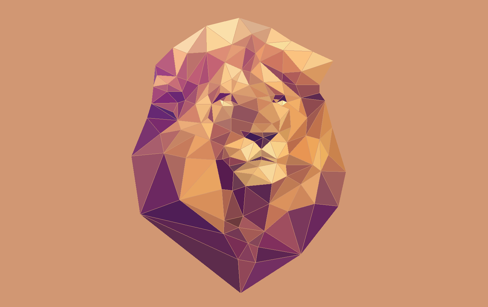

# Project 1: Rasterizer

## Task 1: Drawing Single-Color Triangles

To rasterize a triangle, my naive algorithm goes through the following process:

 - First, calculate the area of the triangle, using the formula $$A = \frac{1}{2}(x_0y_1 + x_1y_2 + x_2y_0 - x_1y_0 - x_2y_1 - x_0y_2)$$. If the area is positive, the winding order of the points must be clockwise; if the area is negative, the winding order of the points must be counterclockwise.
 - If the winding order is counterclockwise, swap points 1 and 2 to make the winding order clockwise.
 - Calculate the bounding box of the 3 points
 - Loop through all the points in the bounding box, in row-major order (same order as the `sample_buffer` matrix)
    - for each point, perform the 3 line tests. If all 3 tests pass, fill the corresponding pixel in `sample_buffer`.

The line tests implement the "left-top" rule for deciding points on the edges of the triangle. This algorithm only considers points in the bounding box of the triangle, so it should perform no worse than any other algorithm that checks each sample in the bounding box of the triangle.

As expected, this algorithm tends to create jaggies. In Example 2 below, there is also the illusion of "disconnected" points as only a few samples fall inside the triangle.

Example 1                           |  Example 2
:----------------------------------:|:--------------------------------------:
  |  

After implementing the naive algorithm, I then implemented an optimized version: 
 - Calculate area, swap points, and calculate the bounding box (just like the naive algorithm)
 - Loop through all the y values in the bounding box
    - For each y value, calculate the x-intercepts of the 3 lines through that horizontal line. Use line tests to determine which side of the x-intercept is inside the triangle.
    - Take the intersection of the 3 lines segments to determine then endpoints of the horizontal line segment inside the triangle.
    - Use `std::fill_n` to fill the corresponding samples inside the line segment with `color`.

This optimized version tends to have between 2.5x and 8x faster frame times than the naive algorithm. Here's a handy-dandy chart of a few tests I ran:

The raw timing data can be found [here](timing_data.tsv).

## Task 2: Antialiasing by Supersampling

Supersampling is a useful antialiazing technique because it is effective at reducing "jaggies", and closely approximates what a high-fidelity version of the image would look like if mapped onto the limited number of pixels. Compared to other antialiasing techniques, supersampling is conceptually simple, and also avoids "background leak". With some alternate antialiasing techniques (for example, one that blurs the edges of the triangle before drawing), the background pixels get mixed with the triangles pixels, which may end up causing the background to "leak" into edges where two triangles meet.

Supersampling was used for drawing triangles by scaling the triangle up, taking a sample for each "scaled" pixel, then once all the triangles were drawn, averaging the scaled pixels to get the value of each "regular" pixel. 

To accommodate supersampling, several changes needed to be made to the rendering pipeline:

 - The `sample_buffer` needed to be resized to `(width * height * samples * samples)`, where `samples` is the integer square root of the sample rate. This new length was used when the buffer was initialized, but also whenever the dimensions were changed and whenever the buffer was cleared.
 - The `rasterize_point` method was changed to loop through all the samples corresponding to that pixel
 - The `rasterize_triangle` method needed to scale all the points up by `samples`, in order to correctly map onto the `sample_buffer`
 - The `resolve_to_framebuffer` method needed to average all the samples corresponding to each pixel, in order the get the true pixel color.

The resulting images are significantly nicer, particularly with high sample rates. Here is an example at 1, 4, 9, and 16 samples:

:----------------------------------:|:--------------------------------------:
  |  
  |  

I also implemented jittered supersampling, which takes samples from a random point within each subpixel, rather than the middle of each subpixel. The effect of this is particularly noticeable on horizonal edges, where the average value of the pixels more accurately reflects how far down the edge is. Non-jittered supersampling with 4 samples can only fully color an edge, half color an edge, or not color an edge; this is doesn't accurately represent edges that, for example, cover 1/3rd of a row of pixels. The downside is that the jittered image appears less "smooth".

Normal                         |  Jittered
:----------------------------------:|:--------------------------------------:
  |  