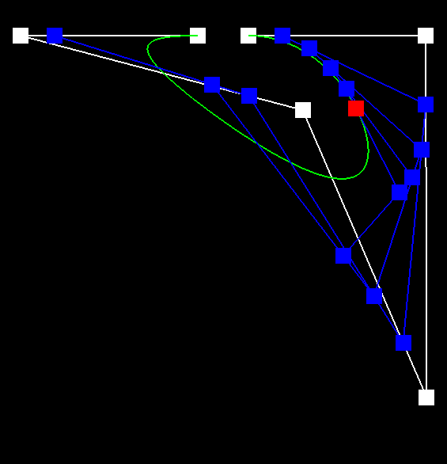

# Project 2: MeshEdit

## Overview

In this project, I implemented parts of a simple bezier curve and mesh editor. This editor can
 - draw wavy lines
 - draw a 2d surface made of wavy lines
 - draw smoothish triangles
 - flip the edge between two triangles
 - split the edge between two triangles
 - turn triangles into more triangles

which makes it useful for manipulating 3d triangle meshes, especially if all you want is more triangles.

## Task 1: Bezier Curves with 1D de Casteljau Subdivision

One algorithm for calculating bezier curves given a set of control points is De Casteljau's algorithm. For a set of $$n$$ control points, the algorithm recursively defines $$n$$ "levels", where the control points are the 0th level, and each successive level is defined by

$$p_i^{l} = (1 - t) p_{i}^{(l-1)} + t p_{i+1}^{(l-1)} $$

where $$t$$ is the parameter of the curve. The final point on the curve is then given by $$p_0^{n-1}$$.

Implementation-wise, I implemented the `evaluateStep` function, which computed the next level from a given level (both levels represented as vectors of points). Calling this function $$n-1$$ times for every value of $$t$$ results in the final bezier curve.

Here's an example bezier curve:

Level 0  |  Level 1 | Level 2 
:--:|:--:|:--:
 |  |  

Level 3 | Level 4 | Level 5 
:--:|:--:|:--:
 |  | 

Here's a slightly different example, with different control points and a different value of $$t$$:

Level 0  |  Level 1 | Level 2 
:--:|:--:|:--:
 |  |  

Level 3 | Level 4 | Level 5 
:--:|:--:|:--:
 |  | 

## Task 2: Bezier Surfaces with Separable 1D de Casteljau

To extend De Casteljau's algorithm to a grid of control points (parametrized by $$(u, v)$$), one can simply apply the algorithm to each row of control points (using $$v$$ for $$t$$), then treat the final "column" of results as control points with parameter $$u$$.

Implementation-size, I implemented a 3d version of the `evaluateStep` function, then used it to implement `evaluate` using the above method.

Here is the Utah teapot, rendered using a Bezier surface:

## Task 3: Area-Weighted Vertex Normals

For many objects, it is desirable to have smooth shading that hides the appearance of individual triangles. One method of achieving this is Phong shading, where normals are calculated at each vertex and then interpolated across each face.

To calculate the normals at each vertex, the `normal` function loops through every outgoing half-edge and adds up the cross product of the half-edge's magnitude and the next half-edge's magnitude (ignoring the ones corresponding to a "virtual" boundary face). This effectively adds up an area-weighted normal for each face. 

Here's a shading comparison on the Utah teapot:

Flat shading | Phong shading  
:--:|:--:
 | 

On this model, the Phong shading looks much more natural and the underlying polygons are much less apparent.

## Task 4: Edge Flip

An edge flip operation roughly corresponds to this diagram:

To implement edge flips I reassigned pointers until I thought the mesh would look like the diagram. This was slightly harder than expected because I picked a terrible naming convention for my mesh elements (for example, in the above diagram, halfedge `bc` ends up going from `a` to `d`). In the end, I ended up with:
 - each face gets its `halfedge()` reassigned
 - each vertex gets its `halfedge()` reassigned
 - all 6 halfedges involved get their `next()` reassigned
 - halfedges `bc` and `cb` get their `vertex()` reassigned
 - halfedges `ab` and `dc` get their `face()` reassigned

Here is the result of some edge flips on the Utah teapot:

Before | After  
:--:|:--:
 | 

My debugging journey for this part was very uneventful, because I am perfect and never write bugs.

## Task 5: Edge Split

An edge split operation roughly corresponds to this diagram:

To implement edge splits I reassigned pointers until I thought the mesh would look like the diagram. Again, I regretted my terrible naming convention, but not enough to change it. In the end, I ended up with:
 - 2 new faces (`face_b` and `face_c`), 3 new edges (`e1`, `e2`, and `e3`), and 6 new halfedges (`am`, `ma`, `bm`, `mb`, `dm`, and `md`) get created
 - vertices `m` and `b` get their `halfedge()` reassigned (note that `b` loses its "original" edge)
 - every face gets its `halfedge()` reassigned
 - all 4 edges get their `halfedge()` assigned
 - the 4 "boundary" halfedges get their `face()` and `next()` reassigned
 - the 8 "inner" halfedges get all their neighbors assigned

Here is the result of some edge splits on the Utah teapot:

Before | After  
:--:|:--:
 | 

Here is the result of some edge splits and some edge flips on the Utah teapot:

Before | After  
:--:|:--:
 | 

My debugging journey for this part was very uneventful, because I am perfect and never write bugs.

## Task 6: Loop Subdivision for Mesh Upsampling

Loop subdivision was achieved by following the instructions in the spec:
 - all the new positions of the vertices are calculated via weighting scheme
 - all the positions of the soon-to-be-created new vertices are calculated via weighting scheme
 - all existing edges and vertices are marked as "old"
 - every existing edge is split, with the created edges being marked as "new", and the newly created vertex being marked as "new".
 - every new edge that connects an old vertex and a new vertex is flipped
 - all vertex positions are updated using the values calculated at the beginning

One notable implementation "trick" is that in order to loop over only the original edges when splitting, I counted the number of edges at the beginning and only looped through that many edges. This works because newly created edges are appended to the end of the edge list.

Loop subdivision tends to "round out" sharp creases, as shown on this donut:

Before | After 4 rounds of loop subdivision
:--:|:--:
 | 

This effect can be migitated by pre-splitting some edges. For example, this is the result of pre-splitting some edges on two of the donut's original sides:

Before | After pre-splitting, then 4 rounds of loop subdivision
:--:|:--:
 | 

The smoothing tends to smooth `cube.dae` into an oblong shape. It's oblong because of the slight asymmetry in how the square faces are split along one diagonal into two triangles.

Before | After 2 rounds of loop subdivision | After 5 rounds of loop subdivision
:--:|:--:|:--:
 |  | 

The asymmetry can be alleviated by making the original mesh symmetric. For example, subdividing the cube faces into 4 triangles instead of 2 makes the result slightly less oblong, and a bit more cube-ish:

Before | After 2 rounds of loop subdivision | After 5 rounds of loop subdivision
:--:|:--:|:--:
 |  | 

## Where to find this webpage

[https://cal-cs184-student.github.io/sp23-proj-webpage-sberkun/proj2/](https://cal-cs184-student.github.io/sp23-proj-webpage-sberkun/proj2/)
