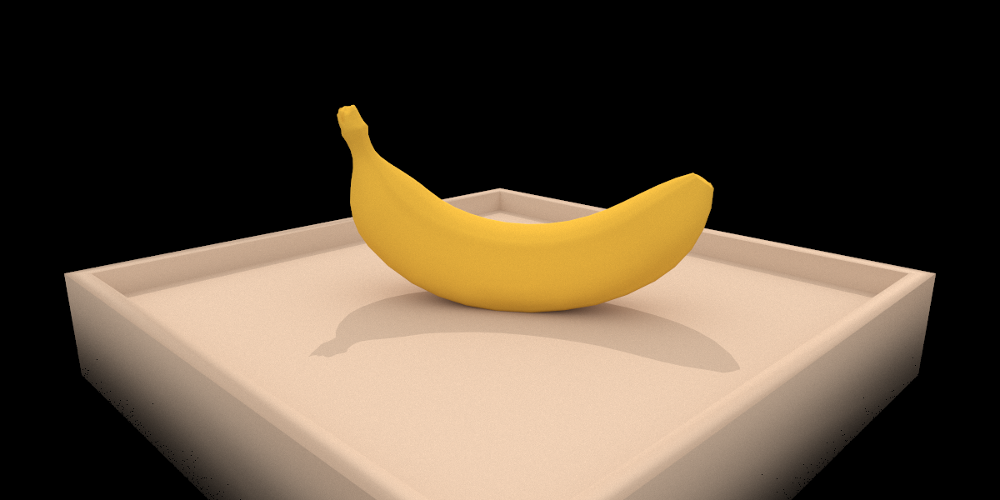
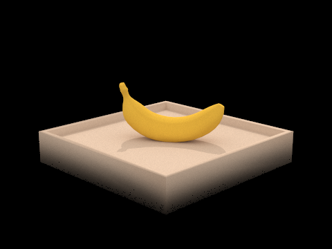

# Project 3-1: Pathtracer 1

## Overview 

In this project, I implemented parts of a simple path tracer, with some minor optimizations. The path tracer can render objects with diffuse BSDFs, and includes BVH and one-bounce light importance sampling optimizations. I implemented the following parts of the path tracer:
 - generation of light rays and intersection with triangles and spheres
 - bounded volume hierarchy (BVH) for efficiency when many primitives are present
 - direct illumination
 - global illumination
 - adaptive sampling

## Task 1: Ray Generation and Scene Intersection

To generate rays from the camera, my path tracer does the following:
 - for each ray to sample, 
    - sample a random point in the square from $$(x, y)$$ to $$(x + 1, y + 1)$$
    - convert the point to normalized coordinates (between 0 and 1)
    - in camera coordinates, calculate where the point falls on the virtual sensor plane, then calculate the direction from the camera origin to the virtual sensor plane
    - convert the direction from camera coordinates to world coordinates, and normalize it 
    - create a ray, with an origin at the camera, and the direction that was just calculated. Set `min_t` and `max_t` of the ray to correspond to near and far clipping planes
    - raytrace the ray (`est_global_illumnation`)   
 - average the results from each ray

To calculate whether a ray intersects a triangle, my path tracer uses the [Möller-Trumbore intersection algorithm](https://en.wikipedia.org/wiki/M%C3%B6ller%E2%80%93Trumbore_intersection_algorithm) to calculate $$t$$ and the barycentric coordinates. It then returns an intersection if $$t$$ is within the ray's range, and the barycentric coordinates are all positive. It also interpolates the barycentric coordinates to calculate the surface normal, and "cuts off" the ray at the intersection point by setting `max_t`.

To calculate whether a ray intersects a sphere, my path tracer computes the quadratic resulting from $$(o + td - c)^2 = R^2$$, where $$o$$ is the origin of the ray, $$d$$ is the ray's direction, $$c$$ is the center of the sphere, and $$R$$ is the sphere's radius. It returns true if the intersection times are real and either one falls within the ray's range, setting the surface normal and cutting off the ray as needed. 

Here are some example images:

 banana.dae             |  CBspheres.dae
 :---------------------:|:----------------------:
   |  

## Task 2: Bounded Volume Hierarchy

Looping through every primitive whenever an intersection needs to be calculating is inefficient, so to speed this up, I implemented a BVH tree. To construct the tree, my algorithm works as following:
 - if there are fewer than `max_leaf_size` elements, return a leaf node with all the primitives
 - calculate the bounding box of the centroids of each primitive.
 - split the "centroid box" in half along its longest axis
 - partition the primitives based on where their centroids fall
 - recursively construct a BVH tree for each half

I chose to partition based on where the centroids fall because I didn't want to worry about the size of each primitive. Larger primitives tend to have centroids far away from everything else, so this algorithm does a decent job of separating them from the more intricate parts of each mesh. By partitioning based on centroids, this algorithm also ensures it never runs into a situation where all the polygons are on one side of the partition.

Here are some images that are only feasible to render with BVH acceleration:

 CBlucy.dae            |  wall-e.dae
 :--------------------:|:--------------------:
  |  

Here's a performance comparison between BVH-based rendering and the naive method:

 file | Primitives | Naive render time                          |  BVH render time | Speedup
 :-- | ---:| ---:| ---: | ---:
 maxplanck.dae | 50801 | 234.953s | 0.0621s | 3783
 cow.dae    | 5856 | 24.833s  |  0.0471s | 527 
 banana.dae | 2458 | 11.236s  |  0.0318s | 353

From this data, we can conclude that BVH is a little faster than the naive implementation, especially when there are large amounts of primitives (note the over 3000x speedup on `maxplanck.dae`). This is explained by the fact that the render time with BVH scales logarithmically with the number of polygons, while the naive algorithm scales linearly. If I had the patience to render the even more complex files (such as `wall-e.dae`) with the naive renderer, I'm sure they would show even more drastic speedups.

## Task 3: Direct Illumination

Direct illumination can either be done with uniform hemisphere sampling, or with importance sampling. Both methods aim to calculate the following Monte Carlo estimation:

$$\frac{1}{N} \sum_{j=1}^{N} \frac{f_r(p, w_j \to w_r) L_i(p, w_j) \cos \theta_j}{p(w_j)}$$

The uniform hemisphere sampling algorithm does so as follows:
 - for each light ray, sample a random ray $$w_j$$ from a uniform hemisphere distrubution. Note that for this distribution, $$p(w_j) = \frac{1}{2 \pi}$$
 - simulate $$w_j$$ with 0-bounce illumination: it either hits a light source, or it doesn't. If it doesn't hit a light source, $$L_i(p, w_j)$$ will be 0.
 - Calculate the other terms and add to the Monte Carlo estimator.

This is fairly intuitive, and matches the logic of the recursive algorithm in task 4. However, the downside is that most of the rays will "miss" light sources, making it fairly inefficient.

To remedy this flaw, the importance sampling algorithm works as follows:
 - for each light, do the following
    - for each light ray, sample a random ray $$w_j$$ between the light source and the intersection point. The pdf for this distribution depends on the type of light source, but it accounts for the fact that we're only sampling within the rays that will "hit".
    - if $$w_j$$ is on the correct side of the intersection point, and $$w_j$$ doesn't intersect any other objects, calculate the 0-bounce illumination along $$w_j$$. Otherwise, the illumination is 0.
    - Calculate the other terms and add to the Monte Carlo estimator.
 - add up the affects of all the light sources.

Here are some comparison images:

Uniform Hemisphere Sampling   |  Importance Sampling
:----------------------------------:|:--------------------------------------:
  |  
  |  
 | 

Note that the last image is completely black when rendered using uniform hemisphere sampling, because uniform hemisphere sampling can not render point lights.

Here's the bunny scene rendered with importance sampling with different numbers of light rays (in order: 1, 4, 16, and 64 light rays. 1 sample per pixel used for all images):

:----------------------------------:|:--------------------------------------:
  |  
  |  

In the soft shadows underneath the bunny, the noise level decreases drastically when the number of light rays is turned up. However, the temperature of my laptop also increases drastically, so it looks like 16 might be the "sweet spot" before I get 3rd-degree burns.

Overall, importance sampling results in much less noise and faster convergence when there are a small number of lights. It can also render point lights, which are not possible to render with uniform hemisphere sampling. However, the complexity of importance sampling increases linearly with the number of lights, so perhaps it may perform worse in scenes with large numbers of emitters. 

## Task 4: Global Illumination

To simulate indirect lighting, I implemented a recursive algorithm with russian roulette. The algorithm works roughly as follows:
 - it first checks the depth, returning black if the depth is too deep
 - it calls `one_bounce_radiance` to get the direct lighting effect
 - with probability 0.3, it terminates (russian roulette). This is done after the direct lighting effect to guarantee that direct lighting is always included, since not including it would add significant noise. 
 - otherwise, it samples a bounce off the the surface, generating a new ray. It recurses on the new ray, then adds the result (multiplying by some factors to account for reflectance and Monte Carlo math stuff, and dividing by 0.7 to account for russian roulette)

Here are some example images with global illumination turned on:

:----------------------------------:|:--------------------------------------:
  |  

Note that the edges of the box in the banana render are less shadowy, and the sphere render shows "color bleeding" from the wall on the spheres. If we decompose the sphere render into direct illumination and indirect illumination, we can see this effect more clearly:

Direct Illumination   |  Indirect Illumination
:----------------------------------:|:--------------------------------------:
  |  

The indirect illumination render looks brighter at the bottom, because rays bouncing from the light to the floor are the greatest source of "depth 2" lighting. Here is what the bunny looks like with different ray depths:

Depth 0   |  Depth 1
:----------------------------------:|:--------------------------------------:
  |  

Depth 2   |  Depth 3
:----------------------------------:|:--------------------------------------:
  |  

Depth 100   |  Depth 1000
:----------------------------------:|:--------------------------------------:
  |  

Note that there are diminishing returns at higher depths; the rays lose energy as they bounce off the surfaces, so "high bounce" rays contribute very little to the overall output. I used russian roulette (with a termination probability of 0.3), so very few rays were actually simulated to high depths: there is almost no computational difference between depth 100 and depth 1000.

We can also examine the effect of different sample rates:

1 sample/pixel   |  2 samples/pixel
:----------------------------------:|:--------------------------------------:
  |  

4 samples/pixel   |  8 samples/pixel
:----------------------------------:|:--------------------------------------:
  |  

16 samples/pixel   |  64 samples/pixel
:----------------------------------:|:--------------------------------------:
  |  

256 samples/pixel   |  1024 samples/pixel
:----------------------------------:|:--------------------------------------:
  |  

The noise decreases dramatically as the sample rate is increased. However, the render time increases proportionally to the sample rate, so simply increasing the sample rate is not a great solution to noise.

The effect of sample rate is particularly noticeable in darker areas - note that the bright parts of the walls are practically noise-free at 64 samples/pixel, while the shadowed portions of the sphere still have a little bit of noise even at 1024 samples/pixel. 

## Task 5: Adaptive Sampling

The goal of adaptive sampling is to sample more for pixels that tend to be noisier (i.e. the unlit part of the sphere), and sample less for pixels that converge quickly (i.e. the walls of the Cornell box). 

I implemented this by batching the samples, and calculating the mean and variance of the pixel after each batch. The algorithm then exits early if the pixel passes this statistical test:

$$(1.96^2)(\frac{\sigma^2}{n}) \leq (t \mu)^2$$

(where $$t$$ is the tolerance, $$\mu$$ is the mean, $$n$$ is the number of samples so far, and $$\sigma^2$$ is the variance). Here are some results:

Image   |  Rate map
:----------------------------------:|:--------------------------------------:
  |  
  |  

As expected, the shadowed parts of the image (which require deeper ray depths to render accurately), tend to have more relative variance, and thus need more samples to converge. Unfortunately, Russian roulette contributes to higher variance, since it inherently causes a twin-peaked distribution for indirect lighting.  
