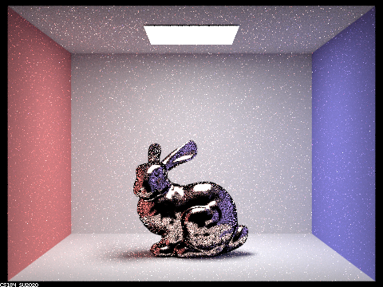

# Project 3-2: Pathtracer 2

## Overview

In this project I implemented additional materials for a simple path tracer. Specifically I implemented:
 - mirror materials
 - refractive materials
 - glass materials (which are a mix of mirror and refractive materials)
 - Microfacet BRDFs

These materials make it possible to render shiny objects. In the following sections I will present several renders of shiny objects.

## Task 1: Mirror and Glass Materials

Mirrors materials are implemented by simply reflecting rays with respect to the surface normal, according to this formula:

$$ \omega_i = - (\omega_o - 2n(\omega_o \cdot n)) $$

where $$n$$ is the surface normal. Note that calculations are done relative to the surface, so the surface normal is always $$(0, 0, 1)$$, making this calculation particularly simple.

Refractive materials are calculated via Snell's law. Specifically given $$\eta$$ (the ratio of the previous index of refraction and the new index of refraction), and the outgoing ray $$\omega_o$$, the incoming ray can be calculated as

$$\omega_i =  - \left(\eta \omega_o.x, \eta \omega_o.y, (\frac{\omega_o.z}{|\omega_o.z|})\sqrt{1 - \eta^2 (1 - \omega_o.z^2)}\right) $$

Finally, glass materials are calculated by mixing mirror and refractive effects with probability given by Schlick's approximation. Specifically, the specular coefficient $$R$$ can be approximated by

$$R = R_0 + (1 - R_0)(1 - \cos \theta)^5$$

$$R_0 = \left( \frac{n_1 - n_2}{n_1 + n_2} \right)^2$$

where $$n_1$$ and $$n_2$$ are the indices of refraction of the two media, and $$\theta$$ is the angle between the surface normal and $$\omega_o$$. $$R$$ is then used as the probability of reflection.

Here are some renders of mirror and glass spheres at different ray depths (0, 1, 2, 3, 4, 5, 10, and 100 respectively):

 :---------------------:|:----------------------:
   |  
   |  
   |  
   |  

The following effects are apparent:
 - At ray depth 0, only the light source itself is shown.
 - At ray depth 1, only direct lighting is shown. This includes the reflections off the top of the spheres.
 - At ray depth 2, some indirect lighting is visible. The ceiling is now indirectly lit, and the reflection of the 3 directly-lit sides is visible in the mirror sphere (which take one bounce off the sphere, then one bounce off a side before hitting the light source).
 - At ray depth 3, there are multiple additional effects: 
     - The directly-lit sides are now visible (refracted) in the glass sphere. This takes 3 bounces (one to enter the sphere, one to exit the sphere, one off a directly-lit side before hitting the light source)
     - A refracted circle of light appears on the floor below the glass sphere. This takes 3 bounces (one off the floor, one to enter the sphere, one to exit the sphere before hitting the light source)
     - The indirectly lit ceiling is now visible in the mirror sphere. This takes 3 bounces (one off the sphere, one off the ceiling, one off a directly-lit side)
 - At ray depth 4, there are multiple additional effects:
    - The reflection of the glass sphere in the mirror sphere now appears blue instead of black. This takes 4 bounces (one off the mirror sphere, one to enter the glass sphere, one to exit the glass sphere, one off the directly-lit blue side)
    - The refracted circle of light below the glass sphere is visible in the mirror sphere. This takes 4 bounces (one off the mirror sphere, one off the floor, one to enter the glass sphere, one to exit the glass sphere).
    - There is glare on the underside of the glass sphere, reflecting the spot of light on the floor. This takes 4 bounces (one off the glass sphere, one off the floor, one to enter the glass sphere, one to exit the glass sphere). 
    - There is a refracted spot of light visible on the right wall, from the reflection of the light source. This takes 4 bounces (one off the wall, one to enter the glass sphere, one to exit the glass sphere, one off the mirror sphere).
 - At ray depth 5, the image is a bit brighter from the additional lighting effects. In particular, the shadow under the glass sphere is now indirectly lit from the glare off the glass sphere. This takes 5 bounces (one off the floor, then 4 for the glare itself).
 - At ray depth 10, the image is a tiny bit brighter from the additional lighting effects, but no more specific effects are discernable.
 - At ray depth 100, the image is indiscernible from ray depth 10 because of Russian roulette.

## Task 2: Microfacet Material

In this part, I implemented microfacet materials, which scatter light according to a normal distribution function. More specifically, I implemented microfacet materials for conductive materials (i.e. gold, silver, copper), which exhibit reflectance according the the Fresnel equations.

First, I implemented the [Fresnel equations](https://en.wikipedia.org/wiki/Fresnel_equations) and the Beckmann distribution function to calculate the reflectance of the material in a given direction. This worked, but tended to output noisy images, as light was still being sampled using uniform hemisphere sampling. I then implemented hemisphere sampling with a PDF of 

$$p_\omega(w_i) = \frac{D(h) \cos \theta_h}{4 (w_i \cdot h)}$$

where $$D(h)$$ is the Beckmann distribution, $$h$$ is the sampled microfacet normal, and $$\cos \theta_h$$ is with respect to the actual surface normal.

Here is a gold dragon with different $$\alpha$$ values (which determines the width of the distribution function). Specifically, these are $$\alpha$$ values of 0.005, 0.05, 0.25, and 0.5:

 :---------------------:|:----------------------:
   |  
    |  

Note that as $$\alpha$$ gets smaller, the material approximates a mirror more, and as $$\alpha$$ gets larger, the material approximates a diffuse surface more. 

At first glance, the Beckmann distribution function is poor at approximating a mirror (compared to an actual mirror material). At very low alpha values, it creates noise, as exhibited by the $$\alpha = 0.005$$ render. 

However, this is simply caused by the architecture of the pathtracer. If the implementation of `is_delta` for microfacet materials is changed from `return false;` to `return alpha <= 0.15;`, the amount of noise is reduced significantly.

Here's a comparison of the results with the improved implementation:

not a delta material | delta material
 :---------------------:|:----------------------:
   |  

Note that cosine hemisphere sampling does work for microfacet materials, it just takes much longer to converge. Here is a comparison of 4 different renders, using the same settings:

hemisphere sampling, not a delta material | Beckmann sampling, not a delta material
 :---------------------:|:----------------------:
   |  

hemisphere sampling, delta material | Beckmann sampling, delta material
 :---------------------:|:----------------------:
   |  

In the above renders, Beckmann distribution sampling reduces the noise when compared to cosine hemisphere sampling. This is especially apparent in the body of the bunny itself, which is lit mainly via indirect lighting. Treating the material as a delta material reduces the noise even further, especially in the walls that are indirectly lit by the bunny.

Finally, here are two more materials (mercury and cobalt).

Mercury | Cobalt
 :---------------------:|:----------------------:
  $$\alpha = 0.015$$ $$\eta = (1.8795, 1.5472, 1.1353)$$ $$k = (5.1076, 4.6437, 3.9980)$$  | $$\alpha=0.25$$ $$\eta = (2.1849, 2.0500, 1.7925)$$ $$k = (4.0971, 3.8200, 3.3775)$$
   |  

Disappointingly, they both just look silver-ish.

## Where to find this webpage

[https://cal-cs184-student.github.io/sp23-proj-webpage-sberkun/proj3-2/](https://cal-cs184-student.github.io/sp23-proj-webpage-sberkun/proj3-2/)
