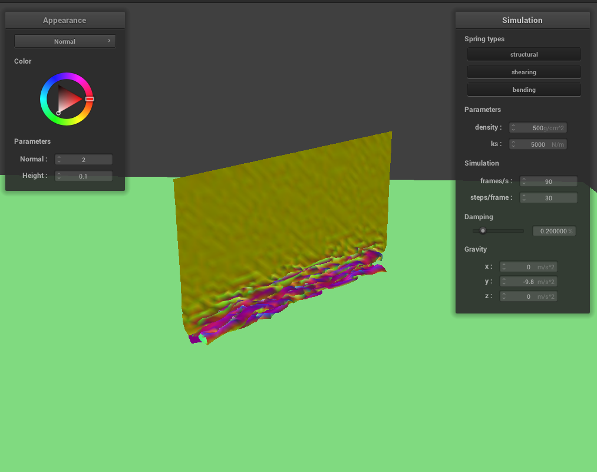
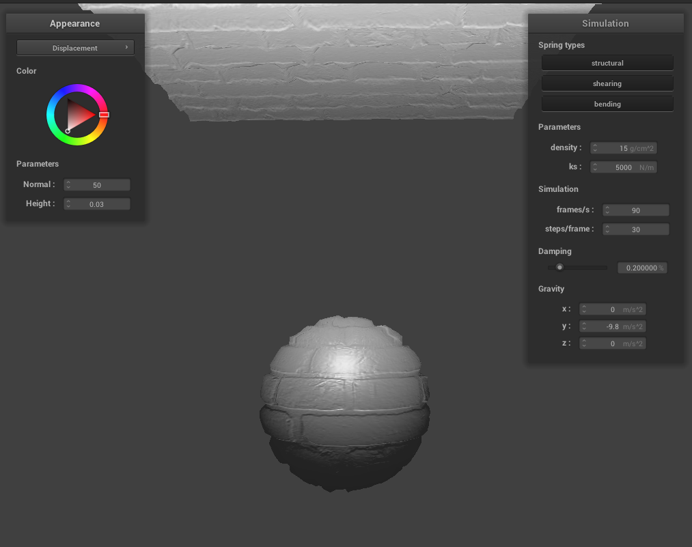

# Project 4: Clothsim

## Overview

In this project I implemented a simple spring-and-mass based cloth simulation, and some shaders to make it look pretty.

The cloth simulation can handle basic forces (gravity), collisions with other objects, and self-collisions. The shaders include diffuse shading, Phong shading, bump mapping, displacement mapping, image textures, and environment textures.

## Part 1: Masses and Springs

The cloth in the cloth simulation is represented as a network of masses and springs. There are springs between adjacent masses (to give it structural integrity), but also between diagonally adjacent masses (to represent resistance to shear forces) and between masses that are 2 units apart (to represent resistance to bending forces).

Here is what the network looks like:

diagonal view | top-down view
 :---------------------:|:----------------------:
   |  

Here are what the different constraints look like (right-click and open in new tab to see the finer detail):

no shearing | only shearing | all
 :---------------------:|:----------------------:
   |   | 

## Part 2: Simulation via numerical integration

To simulate the cloth physics, the simulator computes all the forces on each point mass, then estimates new positions using Verlet integration. For each timestep, the new position of each mass can be estimated as:

$$x_{t + dt} = x_t + (1 - d) * (x_t - x_{t-dt}) + a_t * dt^2$$

Where $$d$$ is the amount of damping in the simulation, and $$a_t$$ is the calculated acceleration. To add realism, the springs are also constrained to not stretch over 10% of their resting length.

There are several parameters to play with: the spring constant, the density of the mesh, and the damping.

With a low spring constant, the mesh seems to be more stretchy at first, but it falls quickly into its resting position (with most of the springs at resting length + 10%). With a high spring constant, the mesh is more elastic, and has a higher resting position. Here are screenshots of the difference in resting positions:

low spring constant | high spring constant
 :---------------------:|:----------------------:
   |  

With a low density, the mesh seems to have the same effect as raising the spring constant. Similarly, raising the density seems to have the same effect as lowering the spring constant. This is probably because the only effect that matters is the relative strengths of gravity and the springs.

low density | high density
 :---------------------:|:----------------------:
   |  

 With low damping, the mesh "bounces" a lot before reaching its final resting position. With high damping, the mesh falls very slowly (as if there's wind resistance), and does not bounce before reaching its final resting position. Here is what they each look like mid-fall:

low damping | high damping
 :---------------------:|:----------------------:
   |  

With the default parameters, here is `pinned4` in all of its glory:

wireframe | cheese texture
 :---------------------:|:----------------------:
   |  

## Part 3: Handling collisions with other objects

To handle interactions with other objects, each point mass needs to have its position adjusted when it collides with another object. Specifically:
 - for spheres, if a point mass ends up inside a sphere, its position is adjusted to bring it back up to the surface of the sphere. It doesn't go all the way to the surface; the position adjustment is affected by damping.
 - for planes, if a point mass ends up on the other side of a plane, its position is adjusted to bring it to the original side of the plane, plus some small surface offset (the plane's "thickness"). Again, this adjustment is affected by damping.

Here is the cloth resting on the sphere with different spring constants:

$$k_s = 500$$ | $$k_s = 5000$$ | $$k_s = 50000$$
 :---------------------:|:----------------------:
   |   | 

With higher spring constants, the cloth is less "bendy" and doesn't wrap around the sphere as much. With lower spring constants, the cloth conforms closer to the surface of the sphere, and hangs straight down instead of at an angle.

Here is the cloth resting serenely on a plane:

wireframe | cheese texture
 :---------------------:|:----------------------:
   |  

## Part 4: Handling self-collisions

The main challenge behind handling self collisions is doing so in less than $$O(N^2)$$ time. To accomplish this, the simulator uses spatial hashing, which maps a small cube of space to a unique float, which can then be used as a key in the hashmap.

The spacial hashing algorithm that I used simply divides the space into small cubes, finds the $$(x, y, z)$$ index of each cube, then returns $$3.14159x + 2.718y + z$$. The float that this returns is unique enough for our purposes.

To check for self-collisions, each point mass can simply be added to a hashmap (mapping from spatial hashes to a list of point masses corresponding to that hash), then each point mass only needs to check the spatial cube it is in as well as the surrounding spatial cubes. This is much faster than checking every pairwise combination of point masses.

Here is a cloth falling vertically:

beginning of fall | middle of fall | resting
 :---------------------:|:----------------------:
   |   | 

Note that in the first two screenshots, the cloth folds on itself, rather than just falling straight down. Also note that in the resting state, part of the cloth is raised, as its resting on top of another part of itself.

Varying the density and spring constant affects how tightly the cloth folds on itself. At a high density, the cloth is very "wrinkly" and falls more vertically, while a low density creates larger, wider folds. The same effect happens when varying the spring constant (since the only thing that matters is the ratio of forces between gravity and the springs). At a low spring constant, the cloth is very "wrinkly", while a high spring constant creates larger folds.  

high density | low density
 :---------------------:|:----------------------:
   |  

 low spring constant | high spring constant
 :---------------------:|:----------------------:
   |  

## Part 5: Shaders

Of course, the entire simulation is for nought if it doesn't look pretty. To make it look pretty, I implemented several shader programs to color the mesh.

A shader program is a small, C-like program that runs lots of times in parallel. For a vertex shader, it runs on every vertex in parallel, calculating per-vertex values, and can displace the vertex if it chooses. For a fragment shader, it runs on every pixel in parallel, calculating the per-pixel color. The fragment shader runs after the vertex shader, which means that the vertex shader may output values for the fragment shader to use.

The Blinn-Phong shading model combines specular, diffuse, and ambient components of lighting to create realistic lighting. The ambient component is due to soft lighting from all around the object, the diffuse component is due to light that is diffusely reflected from nearby light sources, and the specular component is due to light that is more directly reflected from nearby light sources. Here is what each component looks like:

ambient | diffuse
 :---------------------:|:----------------------:
   |  

 specular | combined
 :---------------------:|:----------------------:
   |  

In addition to shading models, I also implemented a texture-mapping shader. Here is one screenshot with the Campanile as a texture, and one with a cheese texture:

Campanile | cheese
 :---------------------:|:----------------------:
   |  

One more complex shading model is bump mapping, which pretends that the surface of the mesh is raised in some places. Displacement mapping is similar, except it actually raises the surface of the mesh, rather than just pretending that its raised. 

Here are some screenshots of the cloth and the sphere, using bump mapping and displacement mapping based on `texture_3.png`:

bump mapping | displacement mapping
 :---------------------:|:----------------------:
   |  

Notice that at the edges of the sphere, bump mapping does not actually change the geometry of the object, but displacement mapping does. This is more noticeable on the edges, but not very noticeable on parts of the sphere directly facing the camera.

At first glance, displacement mapping seems more powerful, but it is limited by the resolution of the underlying mesh. Here are how the two techniques with different mesh resolutions:

bump mapping, 16x16 vertices | bump mapping, 128x128 vertices
 :---------------------:|:----------------------:
   |  

displacement mapping, 16x16 vertices | displacement mapping, 128x128 vertices
 :---------------------:|:----------------------:
   |  

With bump mapping, the shading looks almost exactly the same regardless of the mesh resolution. With displacement mapping, the underlying mesh resolution is immediately noticeable.

Last but not least, here is a pretty mirror shader:

 :---------------------:|:----------------------:
   |  

The mirror shader works by calculating a reflected ray at each pixel, then mapping the reflected ray onto an environment cubemap texture.

## Where to find this webpage

[https://cal-cs184-student.github.io/sp23-proj-webpage-sberkun/proj4/](https://cal-cs184-student.github.io/sp23-proj-webpage-sberkun/proj4/)
